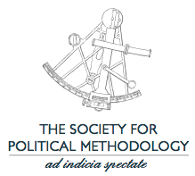

# Jonathan's PA 00

Hello there! My name is Jonathan Monroe. I am a first year MACSS student interested in modelling _Political Behavior_.

_**Education Background**_

-Bachelors degree in Political Science

-Senior undergraduate thesis analyzing Political Psychology and Behavior

I am interested in joining the Society for Political Methodology during my graduate studies:

Also, feel free to add me on Linkedin [here](https://www.linkedin.com/in/jonathan-monroe-139259249/)!

_**My workflow for this assignment is as follows:**_

1. Accepted and initialized the repository.
2. Edited the README to incorporate changes.
3. Created an images folder in the Github repository and linked the image from the folder into the README markdown.
4. Incorporated a link to a website
5. Cloned the repository as a local repository on my computer
6. Made changes to the text file, and added, committed, and pushed the changes back to the Github repository

_**Overview**_

I learned how to incorporate images and links in to markdown, which I never knew how to do previously; this was suprisingly easier than I expected. I also learned how to create headers, bold, and italicize in markdown. I am very happy to have these skills for my future projects in Github!

## 📚  Resources 
* [A short video explaining what GitHub is](https://www.youtube.com/watch?v=w3jLJU7DT5E&feature=youtu.be) 
* [Git and GitHub learning resources](https://docs.github.com/en/github/getting-started-with-github/git-and-github-learning-resources) 
* [Understanding the GitHub flow](https://guides.github.com/introduction/flow/)
* [How to use GitHub branches](https://www.youtube.com/watch?v=H5GJfcp3p4Q&feature=youtu.be)
* [Interactive Git training materials](https://githubtraining.github.io/training-manual/#/01_getting_ready_for_class)
* [GitHub's Learning Lab](https://github.com/apps/github-learning-lab)
* [Education community forum](https://education.github.community/)
* [GitHub community forum](https://github.community/)
